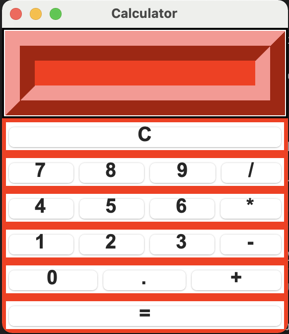

## Project Name:  OSSA
## OpenSource Software Assignment 4: Contributing to Open Source Software
## Project: Simple Calculator In GUI Python With Source Code

This Simple Calculator In GUI is a simple project developed using Python. The project contains the numbers, operators, and signs like on a normal calculator. Here, the user can just click on the numbers they want in the calculations. Hence, the user can use a simple calculator from this application.

The project file contains a python script (calculator_gui.py). This is a simple GUI-base project which is very easy to understand and use. 

### About system
This Simple Calculator In GUI project is in Python. Talking about the features of this system, this python application is designed to calculate entered numbers to any operations and it is not capable of handling all types of exceptions.

The app displays error message when dividing by 0
Error message when pressing the = button
Also, the design of this system is pretty simple so that the user won’t get any difficulties while working on it.

### Prerequisite

Your host machine need to have python installed.

### How To Run The Project?
To run this project, you must have installed Python on your PC. After downloading the project, follow the steps below:

 
**Step1:** Extract/Unzip the file

**Step2:** Go inside the project folder, open cmd then type `python calculator_gui.py` and enter to start the system.

__OR__

**Step2:** Simply, double-click the calculator_gui.py file and you are ready to go.

You will be able to see Calulator GUI as below - 

The Simple Calculator In GUI Python With source code is free to download, Use for educational purposes only! 
This submission is part of a Open Soruce Software engineering course project
